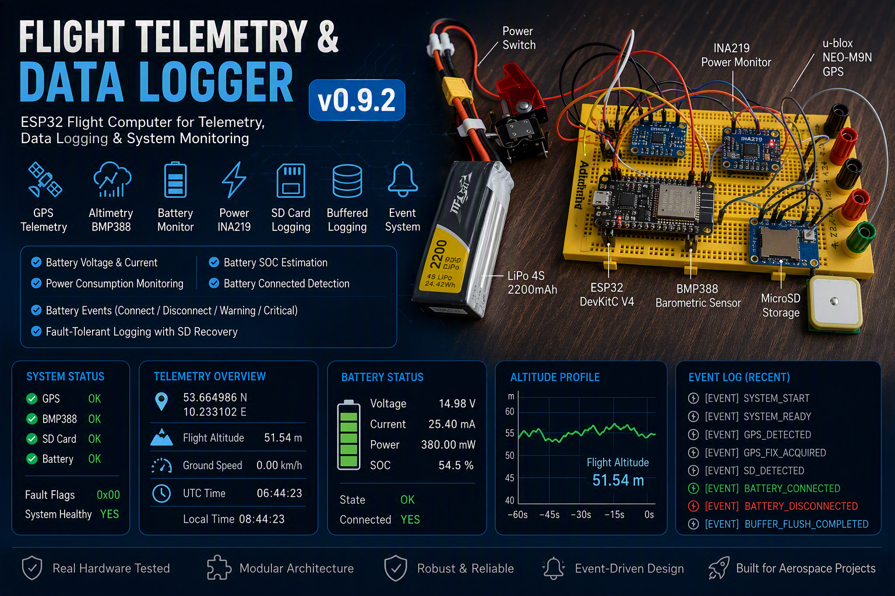
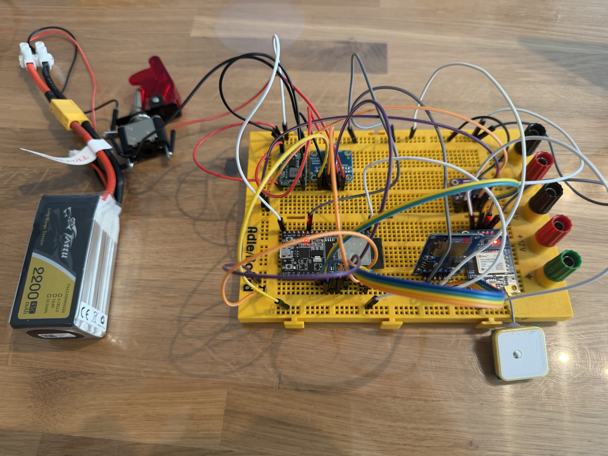

# 🚀 Flight Telemetry & Data Logger

ESP32-based flight computer featuring GPS telemetry, altitude estimation, battery monitoring, event-driven diagnostics and fault-tolerant flight data logging.



---

# Real Hardware Prototype

Hardware configuration used during validation testing.

- ESP32 DevKitC V4
- u-blox NEO-M9N GPS
- BMP388 Barometric Sensor
- INA219 Power Monitor
- MicroSD Storage
- MP1584 Buck Converter
- LiPo 4S Battery




---

# Overview

Flight Telemetry & Data Logger is a modular ESP32-based flight computer designed for real-time telemetry acquisition, altitude estimation and reliable flight data recording.

The system combines:

- GPS telemetry
- Barometric altitude measurement
- Battery monitoring
- Event-driven diagnostics
- Fault-tolerant logging
- Runtime health monitoring

All features have been validated on real hardware.

---

# Hardware

```text
ESP32 DevKitC V4
BMP388 Barometric Sensor
u-blox NEO-M9N GPS
INA219 Power Monitor
MicroSD Storage
MP1584 Buck Converter
Tattu LiPo 4S Battery
```

---

# Features

## Telemetry

✅ GPS Position

✅ GPS Altitude

✅ Ground Speed

✅ UTC Time Acquisition

✅ GPS Timestamp Generation

---

## Altitude System

✅ BMP388 Pressure Measurement

✅ Temperature Measurement

✅ Relative Altitude Estimation

✅ Flight Altitude Calculation

✅ GPS Speed Deadband Filtering

---

## Power Monitoring

✅ INA219 Integration

✅ Battery Voltage Monitoring

✅ Current Measurement

✅ Power Consumption Monitoring

✅ Battery SOC Estimation

✅ Battery Connection Detection

✅ Battery State Monitoring

✅ Battery Hot-Plug Detection

✅ Battery Event System

---

## Logging

✅ Automatic CSV Logging

✅ GPS Timestamped Filenames

✅ Buffered Logging

✅ Automatic Buffer Flush

✅ FIFO Preservation

✅ SD Recovery Logging

✅ Fault-Tolerant Telemetry Storage

---

## Reliability

✅ Power-On Self Test (POST)

✅ Runtime Health Monitoring

✅ Fault Flags

✅ Error Counters

✅ Runtime Event System

✅ SD State Machine

✅ SD Removal Detection

✅ SD Recovery Detection

---

# Runtime Event System

Supported events:

```text
SYSTEM_START
SYSTEM_READY

GPS_DETECTED
GPS_FIX_ACQUIRED
GPS_FIX_LOST

SD_DETECTED
SD_REMOVED
SD_INSERTED
SD_RECOVERED

BATTERY_CONNECTED
BATTERY_DISCONNECTED

BATTERY_WARNING
BATTERY_CRITICAL

BUFFER_FLUSH_COMPLETED
```

Example:

```text
[EVENT] BATTERY_CONNECTED

[EVENT] BATTERY_DISCONNECTED

[EVENT] SD_REMOVED

[EVENT] SD_RECOVERED
```

---

# CSV Format

```csv
timestamp_s,
temperature_c,
pressure_hpa,
bmp_altitude_m,
gps_fix,
latitude,
longitude,
gps_altitude_m,
flight_altitude_m,
speed_kmh,
battery_voltage_v,
current_ma,
power_mw,
battery_soc_percent
```

---

# System Architecture

```text
ESP32 DevKitC V4
│
├── BMP388Sensor
├── GPSSensor
├── INA219Sensor
├── BatteryMonitor
├── SDLogger
├── BufferedLogger
├── SystemHealth
├── SystemEvents
└── Flight Logger
```

---

# Validation Status

Validated on real hardware:

✅ POST Validation

✅ GPS Validation

✅ BMP388 Validation

✅ SD Logging Validation

✅ Buffered Logging Validation

✅ SD Recovery Validation

✅ Health Monitoring Validation

✅ Runtime Event Validation

✅ INA219 Validation

✅ Battery Voltage Validation

✅ Current Measurement Validation

✅ Power Monitoring Validation

✅ Battery Connected Detection

✅ Battery Hot-Plug Validation

✅ Battery Event Validation

✅ CSV Battery Telemetry Validation

---

# Current Status

Release:

```text
v0.9.2
```

Completed:

```text
Sprint 8
- Health Monitoring
- Runtime Events
- SD Diagnostics
- Buffered Logging

Sprint 9
- INA219 Integration
- Battery Monitoring
- Power Telemetry
- Battery Events
- CSV Battery Logging
```

---

# Documentation

```text
docs/TestReport_Sprint8.md
docs/TestReport_Sprint9.md
docs/schematics/
docs/images/
```

---

# Next Milestones

```text
Sprint 10
- MAVLink Integration
- HEARTBEAT
- SYS_STATUS
- GPS_RAW_INT
- BATTERY_STATUS

Sprint 11
- LoRa Telemetry

Sprint 12
- Ground Station
```

---

# License

MIT License