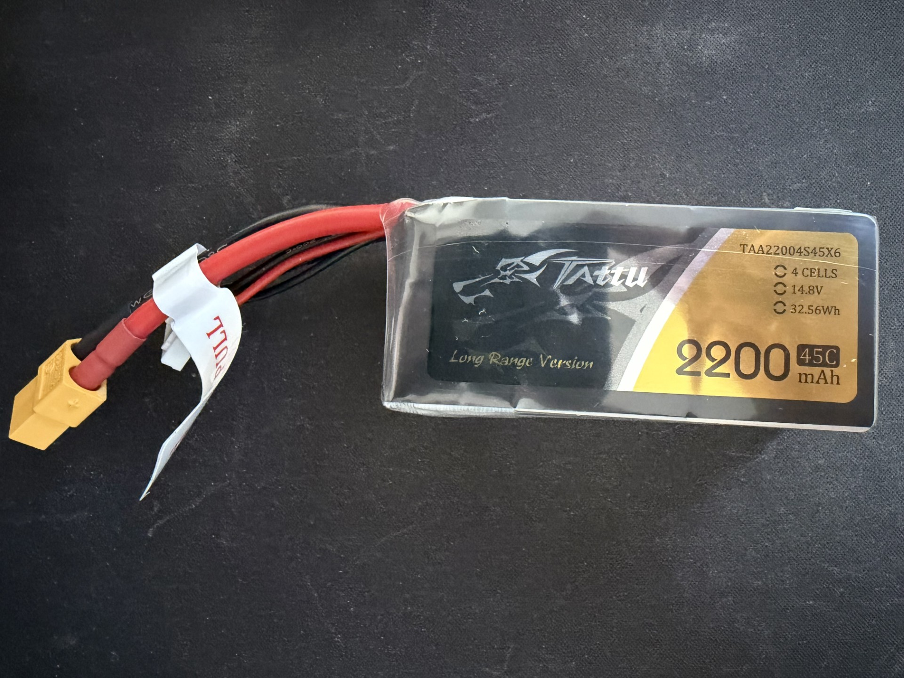

# 🚀 Flight Telemetry & Data Logger

ESP32-based flight computer featuring GPS telemetry, altitude estimation, battery monitoring, MAVLink telemetry, autonomous flight event detection and fault-tolerant flight data logging.


---

# Real Hardware Prototype

Hardware platform used during validation testing.


---

# Hardware

| Component | Model | Function |
|------------|--------|----------|
| Microcontroller | ESP32 DevKitC V4 | Flight computer |
| GNSS Receiver | u-blox NEO-M9N | Position, altitude, UTC time |
| Barometric Sensor | BMP388 | Pressure, temperature, relative altitude |
| Power Monitor | INA219 | Voltage, current, power |
| Storage | MicroSD Module | Flight data logging |
| Power Supply | MP1584 Buck Converter | Regulated 5V rail |
| Battery | Tattu LiPo 4S | System power source |

<table>
  <tr>
    <td align="center"><br><b>NEO-M9N</b></td>
    <td align="center"><br><b>BMP388</b></td>
    <td align="center"><br><b>INA219</b></td>
  </tr>
  <tr>
    <td align="center"><br><b>MicroSD</b></td>
    <td align="center"><br><b>MP1584</b></td>
    <td align="center"><br><b>Tattu LiPo 4S</b></td>
  </tr>
</table>

---

# Overview

Flight Telemetry & Data Logger is a modular ESP32-based flight computer for model rocketry, designed for telemetry acquisition, altitude estimation, power monitoring, autonomous flight event detection, ground station interoperability and reliable flight data recording.

The project combines:

- GPS telemetry
- Barometric altitude estimation
- Battery monitoring
- MAVLink telemetry
- Ground station instrumentation
- Autonomous flight event detection
- Runtime health monitoring
- Event-driven diagnostics
- Fault-tolerant SD logging
- Buffered telemetry recovery
- Unit-tested flight logic

All features included in this repository have been validated on real hardware.

---

# Scope

This flight computer targets **model rocketry**.

The flight state machine models a **ballistic flight profile** with parachute
recovery: powered boost, unpowered coast, a single apogee, and descent under
recovery. Powered controlled vehicles such as multirotors or fixed-wing aircraft
are out of scope by design.

---

# Flight Event Detection

Sprint 12 introduced an autonomous flight state machine that detects the phases
of a rocket flight from barometric altitude, independently of GPS fix.

## Flight states

```text
IDLE -> BOOST -> COAST -> APOGEE -> DESCENT -> LANDED
```

| State | Detection |
|--------|-----------|
| IDLE | On the pad, waiting |
| BOOST | Rapid climb above launch threshold |
| COAST | Climb rate stops increasing (motor burnout) |
| APOGEE | Climb rate crosses zero at altitude |
| DESCENT | Sustained negative climb rate |
| LANDED | At rest on the ground |

Detection uses the BMP388 barometric altitude with a low-pass filtered climb
rate and multi-sample confirmation to reject sensor noise. Each detected event
is reported to the ground station as a MAVLink STATUSTEXT message.


*Flight event sequence reported to QGroundControl via MAVLink STATUSTEXT, including the on-board computed apogee altitude (69.5 m) from a synthetic flight profile.*

---

# Unit Testing

The flight state machine is covered by unit tests running on the host PC through
the PlatformIO `native` environment with GoogleTest, independently of the ESP32.

```text
FlightStateMachine.FullFlightSequence            [PASSED]
FlightStateMachine.IgnoresBarometricNoiseAtIdle  [PASSED]
FlightStateMachine.DoesNotLaunchOnSlowRise       [PASSED]
FlightStateMachine.LaunchesOnFastRise            [PASSED]
FlightStateMachine.ApogeeAltitudeMatchesPeak     [PASSED]
FlightStateMachine.ResetReturnsToIdle            [PASSED]

6 test cases: 6 succeeded
```

Run the tests with:

```bash
pio test -e native
```

---

# Features

## Flight Event Detection

✅ Flight State Machine (IDLE → BOOST → COAST → APOGEE → DESCENT → LANDED)

✅ Barometric, GPS-Independent Detection

✅ Launch Detection

✅ Motor Burnout Detection

✅ Apogee Detection

✅ Descent Detection

✅ Landing Detection

✅ Climb Rate Estimation with Noise Rejection

✅ MAVLink STATUSTEXT Event Reporting

✅ GoogleTest Unit Tests

---

## Telemetry

✅ GPS Position

✅ GPS Altitude

✅ Ground Speed

✅ UTC Time Synchronization

✅ GPS Timestamped Logging

✅ GPS Fix Monitoring

---

## Altitude System

✅ BMP388 Pressure Measurement

✅ Temperature Measurement

✅ Relative Altitude Estimation

✅ Flight Altitude Calculation

✅ Climb Rate Estimation

✅ GPS Speed Deadband Filtering

---

## Power Monitoring

✅ INA219 Integration

✅ Battery Voltage Monitoring

✅ Current Measurement

✅ Power Consumption Monitoring

✅ Battery SOC Estimation

✅ Battery Connection Detection

✅ Battery State Monitoring

✅ Battery Event System

✅ Battery Hot-Plug Detection

---

## Logging

✅ Automatic CSV Logging

✅ GPS Timestamped Filenames

✅ Buffered Logging

✅ Automatic Buffer Flush

✅ FIFO Preservation

✅ SD Recovery Logging

✅ Fault-Tolerant Telemetry Storage

---

## Reliability

✅ Power-On Self Test (POST)

✅ Runtime Health Monitoring

✅ Fault Flags

✅ Error Counters

✅ Runtime Event System

✅ SD State Machine

✅ SD Removal Detection

✅ SD Recovery Detection

---

## MAVLink Telemetry

✅ HEARTBEAT

✅ GPS_RAW_INT

✅ BATTERY_STATUS

✅ GLOBAL_POSITION_INT

✅ GLOBAL_POSITION_INT_COV

✅ SYS_STATUS

✅ VFR_HUD

✅ HOME_POSITION

✅ STATUSTEXT

✅ QGroundControl Integration

---

# MAVLink Telemetry Stack

Current MAVLink implementation validated on real hardware:

| Message | ID | Purpose | Status |
|----------|-----|---------|---------|
| HEARTBEAT | 0 | Vehicle presence and link status | ✅ |
| SYS_STATUS | 1 | System and battery status | ✅ |
| GPS_RAW_INT | 24 | Raw GNSS position and fix type | ✅ |
| GLOBAL_POSITION_INT | 33 | Position and relative altitude | ✅ |
| GLOBAL_POSITION_INT_COV | 63 | Position with covariance | ✅ |
| VFR_HUD | 74 | Ground speed, altitude, climb rate | ✅ |
| BATTERY_STATUS | 147 | Battery voltage, current and SOC | ✅ |
| HOME_POSITION | 242 | Home reference and distance to home | ✅ |
| STATUSTEXT | 253 | Flight event reporting | ✅ |

---

# System Architecture

```text
ESP32 DevKitC V4
│
├── BMP388Sensor
├── GPSSensor
├── INA219Sensor
├── BatteryMonitor
├── SDLogger
├── BufferedLogger
├── SystemHealth
├── SystemEvents
├── MAVLinkTelemetry
├── FlightStateMachine
├── FlightSimulator
└── Flight Logger
```

---

# Runtime Event System

Supported events:

```text
SYSTEM_START
SYSTEM_READY

GPS_DETECTED
GPS_FIX_ACQUIRED
GPS_FIX_LOST

SD_DETECTED
SD_REMOVED
SD_INSERTED
SD_RECOVERED

BATTERY_CONNECTED
BATTERY_DISCONNECTED

BATTERY_WARNING
BATTERY_CRITICAL

BUFFER_FLUSH_COMPLETED
```

---

# Generated Telemetry

```text
System Status

GPS Position

GPS Altitude

Flight Altitude

Relative Altitude

Ground Speed

Climb Rate

Home Reference

Distance to Home

Flight State

Battery Voltage

Battery Current

Battery Remaining %

System Health State
```

---

# CSV Format

```csv
timestamp_s,
temperature_c,
pressure_hpa,
bmp_altitude_m,
gps_fix,
latitude,
longitude,
gps_altitude_m,
flight_altitude_m,
speed_kmh,
battery_voltage_v,
current_ma,
power_mw,
battery_soc_percent
```

---

# Validation Status

Validated on real hardware:

✅ GPS Validation

✅ BMP388 Validation

✅ SD Logging Validation

✅ Buffered Logging Validation

✅ FIFO Recovery Validation

✅ SD Recovery Validation

✅ Runtime Health Monitoring Validation

✅ Event System Validation

✅ INA219 Validation

✅ Battery Voltage Validation

✅ Current Measurement Validation

✅ Power Monitoring Validation

✅ Battery SOC Validation

✅ Battery Event Validation

✅ Battery Hot-Plug Validation

✅ CSV Battery Telemetry Validation

✅ MAVLink HEARTBEAT Validation

✅ MAVLink GPS_RAW_INT Validation

✅ MAVLink BATTERY_STATUS Validation

✅ MAVLink GLOBAL_POSITION_INT Validation

✅ MAVLink GLOBAL_POSITION_INT_COV Validation

✅ MAVLink SYS_STATUS Validation

✅ MAVLink VFR_HUD Validation

✅ MAVLink HOME_POSITION Validation

✅ MAVLink STATUSTEXT Validation

✅ Relative Altitude Validation

✅ Climb Rate Validation

✅ Distance to Home Validation

✅ Flight State Machine Unit Tests (6/6)

✅ Flight Simulation Validation

✅ Real Sensor Robustness Validation (no false positives)

✅ Flight Event Detection Validation

✅ Ground Station Instrument Validation

✅ QGroundControl Connection Validation

✅ MAVLink End-to-End Telemetry Validation

✅ No System Regression

---

# Current Status

```text
Current Development Stage

Sprint 12

Flight Event Detection

Validated on Real Hardware
```

Current capabilities:

```text
GPS Telemetry

Barometric Altitude Estimation

Climb Rate Estimation

Autonomous Flight Event Detection

Battery Monitoring

System Health Monitoring

Fault-Tolerant SD Logging

MAVLink Telemetry

Ground Station Instrumentation

Home Reference & Distance to Home

QGroundControl Connectivity

Unit-Tested Flight Logic
```

---

# Documentation

```text
docs/TestReport_Sprint8.md

docs/TestReport_Sprint9.md

docs/TestReport_Sprint10.md

docs/TestReport_Sprint11.md

docs/TestReport_Sprint12.md

docs/schematics/

docs/images/
```

---

# Next Milestones

```text
Recovery Deployment Output

Flight Data Analysis Tools

ATTITUDE Telemetry

FreeRTOS Architecture

Long-Range Telemetry

Field Test Campaign
```

---

# License

MIT License
