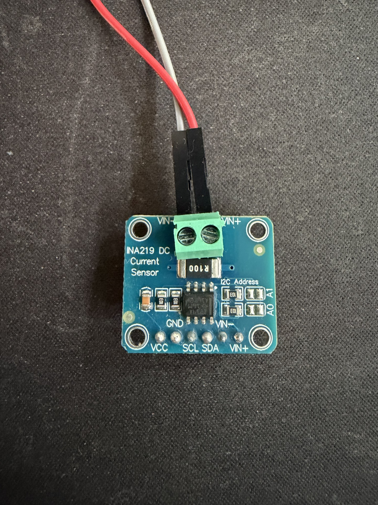
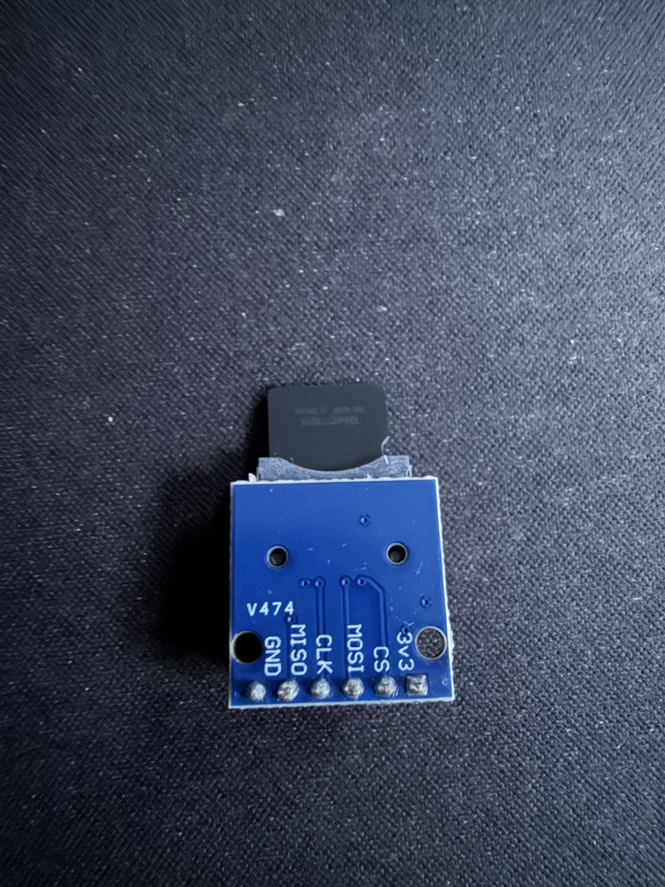
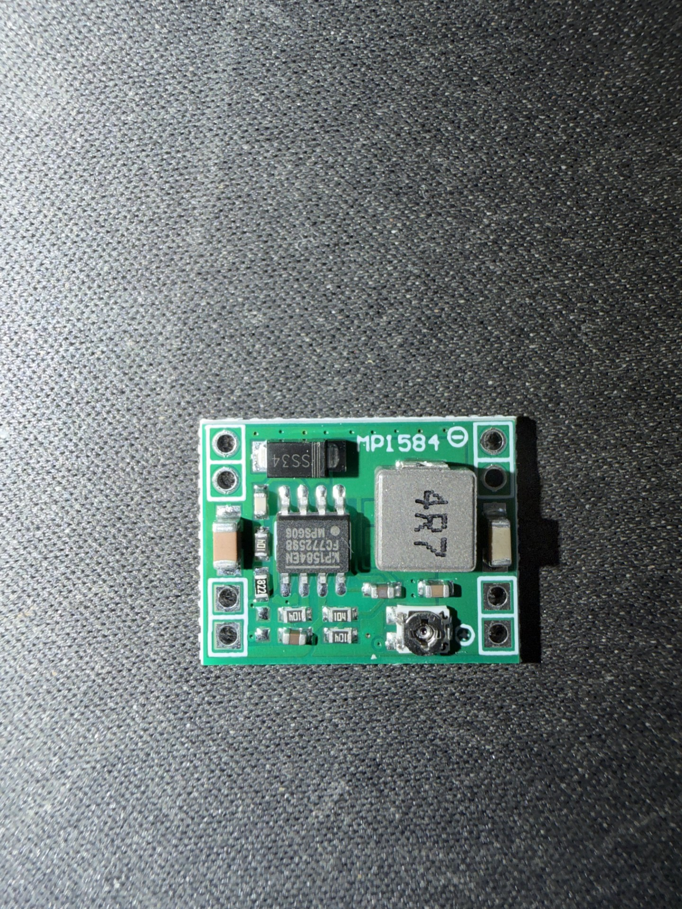
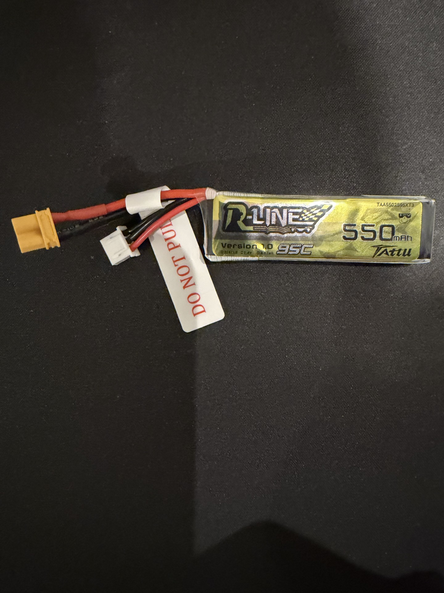
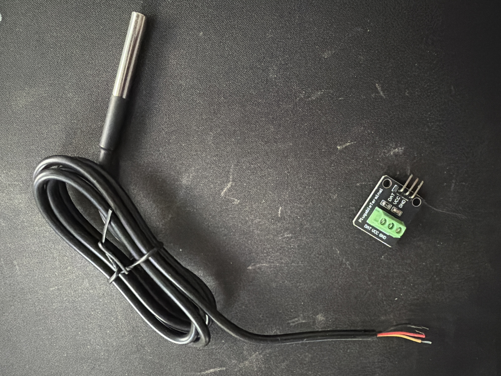
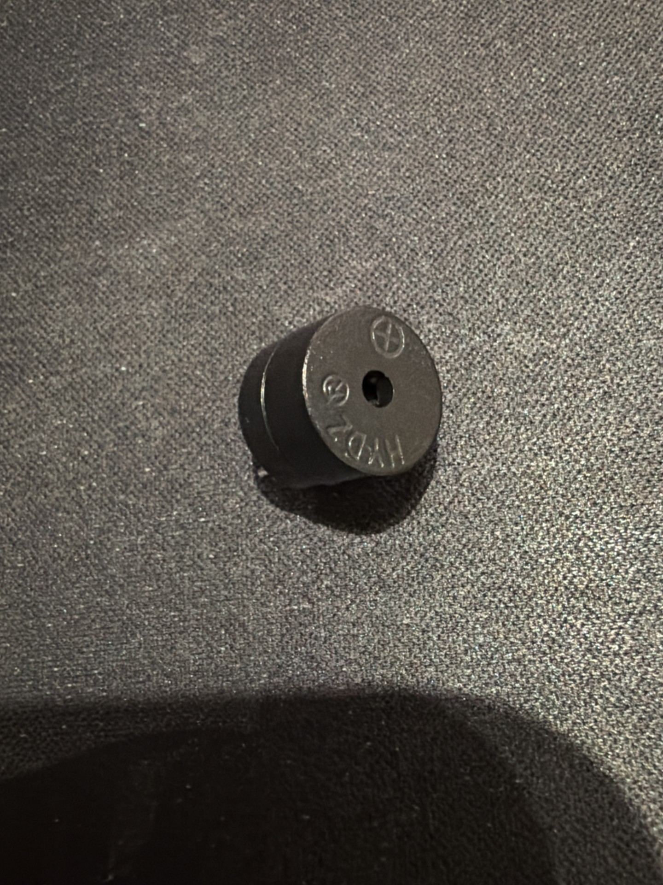
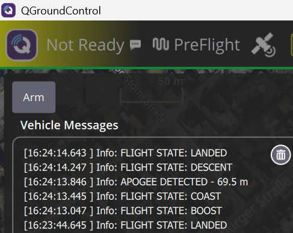

# Flight Telemetry & Data Logger

ESP32-based flight computer featuring GPS telemetry, barometric altitude estimation, dual temperature sensing, battery monitoring, MAVLink telemetry, autonomous flight event detection, audible event feedback, fault-tolerant SD logging, data-driven flight profile replay testing and serial hardware flight profile replay.


---

# Project Status

RocketOS is currently an advanced bench prototype and pre-flight integration platform. The implemented ESP32 DevKitC V4 firmware provides sensing, logging, telemetry, health monitoring, flight-state detection and replay validation.

RocketOS Mk1 targets an ESP32-S3 SuperMini N16R8, a fixed 2S LiPo architecture and a modular deck-based hardware stack for a 54 mm airframe. The Power Deck is under development and has not yet been fabricated or electrically validated.

The current Mk1 development battery is a Tattu 2S 550 mAh LiPo. The firmware BatteryMonitor was migrated from 4S to 2S and bench validated on 2026-08-28.

---

# Real Hardware Prototype

Hardware platform used during validation testing.


---

# Hardware

| Component | Model | Function |
|------------|-------|----------|
| Microcontroller | ESP32 DevKitC V4 | Flight computer |
| GNSS Receiver | u-blox NEO-M9N | Position, altitude, UTC time |
| Barometric Sensor | BMP388 | Pressure, temperature, relative altitude |
| External Thermometer | DS18B20 | Ambient outside temperature |
| Power Monitor | INA219 | Voltage, current, power |
| Storage | MicroSD Module | Flight data logging |
| Audible Feedback | Active Buzzer | Event feedback and recovery beacon |
| Power Supply | MP1584 Buck Converter | Regulated 5 V rail |
| Battery | Tattu LiPo 2S 550 mAh | Current Mk1 development battery |

<table>
  <tr>
    <td align="center"><br><b>NEO-M9N</b></td>
    <td align="center"><br><b>BMP388</b></td>
    <td align="center"><br><b>INA219</b></td>
  </tr>
  <tr>
    <td align="center"><br><b>MicroSD</b></td>
    <td align="center"><br><b>MP1584</b></td>
    <td align="center"><br><b>LiPo 2S Tattu 550 mAh</b></td>
  </tr>
  <tr>
    <td align="center"><br><b>DS18B20</b></td>
    <td align="center"><br><b>Active Buzzer</b></td>
    <td></td>
  </tr>
</table>

---

# Overview

Flight Telemetry & Data Logger is a modular ESP32-based flight computer for model rocketry. It is designed for telemetry acquisition, altitude estimation, environmental sensing, power monitoring, autonomous flight event detection, ground station interoperability, reliable flight data recording and repeatable validation using replayed flight profiles.

The project combines:

- GPS telemetry
- Barometric altitude estimation
- Dual temperature sensing with BMP388 and DS18B20
- Battery and power monitoring
- MAVLink telemetry
- QGroundControl interoperability
- Autonomous flight event detection
- Audible event feedback and recovery beacon
- Runtime health monitoring
- Event-driven diagnostics
- Fault-tolerant SD logging
- Buffered telemetry recovery
- Unit tests for core flight logic
- CSV-based flight profile replay tests
- Serial hardware flight profile replay on ESP32
- OpenRocket and generic CSV import tooling

The validation status of each subsystem is documented separately. Flight-profile replay tests run both on the host computer through the PlatformIO native environment and on the ESP32 through USB serial replay. This evidence does not establish that the complete RocketOS Mk1 hardware stack is flight validated.

---

# Scope

This flight computer targets model rocketry.

The flight state machine models a ballistic rocket flight profile with parachute recovery: powered boost, unpowered coast, a single apogee, and descent under recovery. Powered controlled vehicles such as multirotors or fixed-wing aircraft are out of scope by design.

---

# Flight Event Detection

An autonomous flight state machine detects the phases of rocket flight from barometric altitude, independently of GPS fix.

## Flight states

```text
IDLE -> BOOST -> COAST -> APOGEE -> DESCENT -> LANDED
```

| State | Detection |
|-------|-----------|
| IDLE | On the pad, waiting |
| BOOST | Rapid climb above launch threshold |
| COAST | Climb rate stops increasing after boost |
| APOGEE | Climb rate crosses zero at altitude |
| DESCENT | Sustained negative climb rate |
| LANDED | At rest on the ground |

Detection uses BMP388 barometric altitude with low-pass filtered climb rate and multi-sample confirmation to reject sensor noise. Each detected event is reported to the ground station as a MAVLink STATUSTEXT message and signalled audibly through the buzzer.



*Flight event sequence reported to QGroundControl via MAVLink STATUSTEXT, including the on-board computed apogee altitude from a synthetic flight profile.*

---

# Flight Profile Replay Testing

Sprint 14 added data-driven replay testing for the flight state machine.

Instead of only testing isolated altitude points, full altitude-vs-time CSV profiles are replayed through the same `FlightStateMachine` logic used by the firmware. The detected apogee is compared against the expected apogee declared in a small `.meta` file.

```text
CSV flight profile -> FlightStateMachine replay -> detected apogee -> expected apogee check
```

## Current replay profiles

| Profile | Description | Expected Apogee | Purpose |
|---------|-------------|-----------------|---------|
| `estes_c6` | Small clean flight | 253.9 m | Nominal flight sequence |
| `midpower_machdip` | Mid-power transonic mach-dip case | 904.4 m | False barometric dip rejection |
| `low_apogee` | Low apogee short flight | 71.5 m | Small-flight validation |

The `midpower_machdip` profile includes a synthetic transonic barometric disturbance. The state machine correctly ignores the false dip and detects the real apogee.

## Native test results

```text
RealFlightProfiles/FlightProfileTest.DetectsApogeeWithinTolerance/estes_c6          [PASSED]
RealFlightProfiles/FlightProfileTest.DetectsApogeeWithinTolerance/midpower_machdip  [PASSED]
RealFlightProfiles/FlightProfileTest.DetectsApogeeWithinTolerance/low_apogee        [PASSED]

FlightStateMachine.FullFlightSequence               [PASSED]
FlightStateMachine.IgnoresBarometricNoiseAtIdle     [PASSED]
FlightStateMachine.DoesNotLaunchOnSlowRise          [PASSED]
FlightStateMachine.LaunchesOnFastRise               [PASSED]
FlightStateMachine.ApogeeAltitudeMatchesPeak        [PASSED]
FlightStateMachine.ResetReturnsToIdle               [PASSED]

9 test cases: 9 succeeded
```

Run the test suite with:

```bash
cd firmware/flight-computer
pio test -e native
```

---

# Serial Hardware Flight Profile Replay

Sprint 14b adds a serial hardware replay mode for validating flight profiles on the real ESP32 hardware.

This mode streams a CSV flight profile from the PC to the ESP32 over USB serial. The ESP32 feeds the received altitude samples into the real `FlightStateMachine`, triggering the same flight events used by the firmware.

```text
CSV profile on PC -> USB Serial -> ESP32 -> FlightStateMachine -> buzzer + event output
```

## Purpose

Serial replay bridges the gap between host-based unit tests and real hardware validation.

It validates:

- Flight state detection on the actual ESP32
- Real firmware integration
- Buzzer event feedback
- Serial command handling
- Timing and state transition behaviour with full flight profiles
- Correct handling of long descent profiles

## Protocol

The PC sends:

```text
PROFILE_START
R,<time_ms>,<altitude_m>
R,<time_ms>,<altitude_m>
...
PROFILE_END
```

The ESP32 responds with:

```text
[REPLAY] READY
[REPLAY] START
[FLIGHT] State -> BOOST
[FLIGHT] State -> COAST
[FLIGHT] State -> APOGEE
[FLIGHT] State -> DESCENT
[FLIGHT] State -> LANDED
[REPLAY] END | samples=<count>
```

## Usage

Enable replay mode in `Config.h`:

```cpp
#define SERIAL_PROFILE_REPLAY_MODE 1
#define SERIAL_REPLAY_ALLOW_ACTUATORS 0
#define SERIAL_REPLAY_VERBOSE 0
```

Upload the firmware:

```bash
pio run -e esp32dev -t upload
```

Run a replay profile:

```bash
python tools/send_profile_serial.py test_profiles/low_apogee.csv --port COM5 --speed 1
```

Run the mach-dip profile:

```bash
python tools/send_profile_serial.py test_profiles/midpower_machdip.csv --port COM5 --speed 5
```

Before committing or using the firmware normally, disable replay mode again:

```cpp
#define SERIAL_PROFILE_REPLAY_MODE 0
#define SERIAL_REPLAY_ALLOW_ACTUATORS 0
#define SERIAL_REPLAY_VERBOSE 0
```

## Validated hardware replay profiles

| Profile | Expected Samples | Result |
|---------|------------------|--------|
| `low_apogee` | 491 | PASS |
| `midpower_machdip` | 3265 | PASS |

Both profiles replayed successfully on the ESP32 hardware and triggered the full flight sequence:

```text
BOOST -> COAST -> APOGEE -> DESCENT -> LANDED
```

The corrected `midpower_machdip` profile now descends continuously to ground level without the previous artificial altitude drop.

---

# Flight Profile Data Format

Flight profiles are stored under:

```text
firmware/flight-computer/test_profiles/
```

Each profile uses two files:

```text
profile_name.csv   -> time and altitude samples
profile_name.meta  -> expected apogee and tolerance
```

Example CSV:

```csv
time_s,altitude_m
0.05,0.21
0.10,0.64
0.15,1.28
```

Example metadata:

```text
name: Mid-power - transonic mach dip
source: synthetic
expected_apogee_m: 904.4
tolerance_m: 8.0
```

The manifest file controls which profiles are included in the native test run:

```text
estes_c6
midpower_machdip
low_apogee
```

This avoids platform-specific directory scanning and keeps test discovery portable.

---

# Importing New Flight Profiles

A Python import tool is provided under:

```text
firmware/flight-computer/tools/import_profile.py
```

Supported adapters:

| Source | Use case |
|--------|----------|
| `openrocket` | OpenRocket CSV exports with time and altitude columns |
| `generic` | Generic altimeter or simulator CSV with selectable columns and units |

Example OpenRocket import:

```bash
python tools/import_profile.py --source openrocket exported_flight.csv my_openrocket_flight
```

Example generic import:

```bash
python tools/import_profile.py --source generic altimeter.csv my_real_flight --time-col 0 --alt-col 2 --alt-unit ft --skip-header
```

The importer creates the internal CSV, generates the `.meta` file, calculates expected apogee and updates `manifest.txt`.

---

# Audible Event Feedback

An active buzzer provides distinct rhythmic patterns for system and flight events.

| Event | Pattern |
|-------|---------|
| Startup | Power-up chime |
| GPS Lock | Ready chirp |
| Launch | Launch tone |
| Apogee | Peak alert with priority |
| Landed | Recovery beacon |
| Battery Critical | Warning stutter |

The buzzer driver is non-blocking. Patterns play in the background using a `millis()`-based state machine, so telemetry, logging and event detection are never stalled by a sound. Flight event sounds do not interrupt each other, except apogee, which has priority.

The landing pattern is a deliberately clear, loud repeating beacon intended to help locate the vehicle on the ground after recovery.

---

# Altitude Reference

Flight altitude is computed from the GPS reference altitude captured on the first GPS fix, plus the barometric change measured since that instant:

```text
flight_altitude = gps_reference_altitude + (bmp_altitude - bmp_altitude_at_fix)
```

This avoids barometric drift accumulated before the fix and keeps flight altitude stable and consistent with the GPS reference at liftoff.

---

# Features

## Flight Event Detection

- Flight State Machine (IDLE -> BOOST -> COAST -> APOGEE -> DESCENT -> LANDED)
- Barometric, GPS-independent detection
- Launch, burnout, apogee, descent and landing detection
- Climb rate estimation with noise rejection
- MAVLink STATUSTEXT event reporting
- Audible event feedback
- Unit-tested and replay-tested flight logic

## Environmental Sensing

- BMP388 pressure measurement
- BMP388 internal temperature
- DS18B20 external ambient temperature
- Relative altitude estimation
- Corrected flight altitude calculation
- Climb rate estimation

## Telemetry

- GPS position
- GPS altitude
- Ground speed
- UTC time synchronization
- GPS timestamped logging
- GPS fix monitoring

## Power Monitoring

- INA219 integration
- Battery voltage monitoring
- Current measurement
- Power consumption monitoring
- Battery SOC estimation
- Battery connection detection
- Battery state monitoring
- Battery event system
- Battery hot-plug detection
- Fixed 2S LiPo monitoring baseline
- Battery disconnected below 5.0 V
- SOC curve from 6.60 V = 0% to 8.40 V = 100%
- Warning threshold at 7.20 V
- Critical threshold at 6.80 V

## Logging

- Automatic CSV logging
- GPS timestamped filenames
- External temperature logging
- Flight state logging
- Buffered logging
- Automatic buffer flush
- FIFO preservation
- SD recovery logging
- Fault-tolerant telemetry storage

## Reliability

- Power-On Self Test (POST)
- Runtime health monitoring
- Fault flags
- Error counters
- Runtime event system
- SD state machine
- SD removal detection
- SD recovery detection

## Testing

- GoogleTest host-based unit tests
- Data-driven flight profile replay tests
- Serial hardware flight profile replay on ESP32
- Synthetic mach-dip validation profile
- Corrected mach-dip descent profile
- OpenRocket/generic CSV import support
- 9 native tests passing

---

# MAVLink Telemetry Stack

| Message | ID | Purpose | Status |
|---------|----|---------|--------|
| HEARTBEAT | 0 | Vehicle presence and link status | Validated |
| SYS_STATUS | 1 | System and battery status | Validated |
| GPS_RAW_INT | 24 | Raw GNSS position and fix type | Validated |
| GLOBAL_POSITION_INT | 33 | Position and relative altitude | Validated |
| GLOBAL_POSITION_INT_COV | 63 | Position with covariance | Validated |
| VFR_HUD | 74 | Ground speed, altitude, climb rate | Validated |
| BATTERY_STATUS | 147 | Battery voltage, current and SOC | Validated |
| HOME_POSITION | 242 | Home reference and distance to home | Validated |
| STATUSTEXT | 253 | Flight event reporting | Validated |

---

# System Architecture

```text
ESP32 DevKitC V4
|
|-- BMP388Sensor
|-- ExternalThermometer (DS18B20)
|-- GPSSensor
|-- INA219Sensor
|-- BatteryMonitor
|-- Buzzer
|-- SDLogger
|-- BufferedLogger
|-- SystemHealth
|-- SystemEvents
|-- MAVLinkTelemetry
|-- FlightStateMachine
|-- FlightSimulator
|-- SerialProfileReplay
|-- Flight Profile Replay Tests
|-- Flight Logger
```

---

# Runtime Event System

```text
SYSTEM_START
SYSTEM_READY

GPS_DETECTED
GPS_FIX_ACQUIRED
GPS_FIX_LOST

SD_DETECTED
SD_REMOVED
SD_INSERTED
SD_RECOVERED

BATTERY_CONNECTED
BATTERY_DISCONNECTED

BATTERY_WARNING
BATTERY_CRITICAL

BUFFER_FLUSH_COMPLETED
```

---

# Generated Telemetry

```text
System Status
GPS Position
GPS Altitude
Flight Altitude
Relative Altitude
Ground Speed
Climb Rate
Flight State
Home Reference
Distance to Home
Internal Temperature (BMP388)
External Temperature (DS18B20)
Battery Voltage
Battery Current
Battery Remaining %
System Health State
```

---

# CSV Log Format

```csv
timestamp_s,
temperature_c,
pressure_hpa,
bmp_altitude_m,
ext_temperature_c,
flight_state,
gps_fix,
latitude,
longitude,
gps_altitude_m,
flight_altitude_m,
speed_kmh,
battery_voltage_v,
current_ma,
power_mw,
battery_soc_percent
```

The `ext_temperature_c` column records external DS18B20 ambient temperature. The `flight_state` column records the detected flight phase for each sample, enabling post-flight analysis of when each event was detected.

---

# Repository Structure

```text
docs/
  TestReport_Sprint8.md
  TestReport_Sprint9.md
  TestReport_Sprint10.md
  TestReport_Sprint11.md
  TestReport_Sprint12.md
  TestReport_Sprint13a.md
  TestReport_Sprint14.md
  TestReport_Sprint14b.md
  images/
  schematics/

firmware/flight-computer/
  include/
  lib/
  src/
  test/
    test_flight_state_machine/
    test_flight_profiles/
  test_profiles/
  tools/
  platformio.ini
```

---

# Validation Status

Repository-reported and bench validation evidence includes:

- GPS validation
- BMP388 validation
- DS18B20 external temperature validation
- SD logging validation
- Buffered logging validation
- FIFO recovery validation
- SD recovery validation
- Runtime health monitoring validation
- Event system validation
- INA219 validation
- Battery voltage validation
- Current measurement validation
- Power monitoring validation
- Battery SOC validation
- Battery event validation
- Battery hot-plug validation
- Buzzer pattern validation
- MAVLink telemetry validation
- Relative altitude validation
- Altitude reference validation
- Climb rate validation
- Distance to home validation
- Flight state machine unit tests
- Flight profile replay tests
- Serial hardware flight profile replay
- Synthetic mach-dip profile validation
- Corrected mach-dip descent validation
- QGroundControl connection validation
- No system regression

## 2S BatteryMonitor Bench Validation

Validated on 2026-08-28 after migration from the historical 4S configuration:

- USB-powered hardware with the LiPo disconnected: 4.10-4.13 V, reported `DISCONNECTED`.
- Connected 2S LiPo: 7.72-7.90 V, reported `CONNECTED` / `OK` with a coherent SOC estimate.
- Battery disconnected threshold: below 5.0 V.
- SOC endpoints: 6.60 V = 0% and 8.40 V = 100%.
- Warning threshold: 7.20 V.
- Critical threshold: 6.80 V.

This validates BatteryMonitor behavior on the current bench prototype. It does not claim that the Power Deck PCB has been fabricated, assembled, brought up or electrically validated.

---

# Current Status

```text
Current Development Stage: RocketOS Mk1 power architecture development
Focus: Power Deck v0.1 schematic and PCB development
Firmware Status: Native tests 9/9 passing + hardware replay validated
Battery Status: Fixed 2S baseline + BatteryMonitor bench validated
Power Deck Status: Under development; not fabricated or electrically validated
```

Current capabilities:

```text
GPS Telemetry
Barometric Altitude Estimation
Dual Temperature Sensing
Climb Rate Estimation
Autonomous Flight Event Detection
Audible Event Feedback
Battery Monitoring
System Health Monitoring
Fault-Tolerant SD Logging
MAVLink Telemetry
Ground Station Instrumentation
Home Reference & Distance to Home
QGroundControl Connectivity
Unit-Tested Flight Logic
CSV Flight Profile Replay Testing
Serial Hardware Flight Profile Replay
OpenRocket / Generic CSV Import Tooling
```

---

# Next Milestones

```text
Complete Power Deck v0.1 schematic
Assign verified physical footprints
Pass KiCad ERC and DRC
Review Power Deck before fabrication
Recovery Deployment Output (servo)
Inertial Measurement Unit (GY-87)
Long-Range Telemetry (LoRa)
Raspberry Pi Ground Station
Field Test Campaign
```

---

# License

MIT License